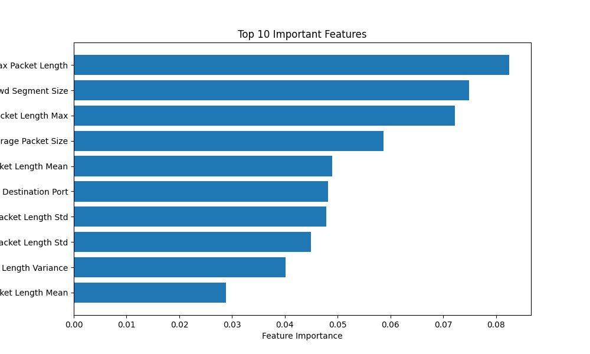

# intelligent-network-threat-detection
AI-powered intrusion detection system using machine learning to identify malicious network traffic in real time

🚀 Intelligent Network Threat Detection

Machine learning-based system to detect malicious network traffic using the CICIDS2017 dataset.

📌 Project Overview

This project builds a classification model to identify malicious vs benign network traffic using real-world cybersecurity data.

It includes:

Data preprocessing pipeline
Feature engineering
Model training (Random Forest)
Evaluation metrics
Feature importance analysis
📊 Dataset
CICIDS2017 dataset
Contains real-world network traffic with labeled attacks
~690K records, 79 features
⚙️ Technologies Used
Python
Pandas, NumPy
Scikit-learn
Matplotlib
🧠 Model
Random Forest Classifier
Handles high-dimensional tabular data effectively
📈 Results
Accuracy: 99.95%
Strong performance across precision, recall, and F1-score

⚠️ Note: High accuracy may indicate class imbalance or overfitting; further validation recommended.

🔍 Key Insights
Packet size-related features are highly predictive
Network flow characteristics strongly influence attack detection
Feature importance reveals meaningful traffic behavior patterns

📊 Feature Importance
## Feature Importance

▶️ How to Run
pip install -r requirements.txt
python main.py
📁 Project Structure
src/
  data_preprocessing.py
  train_model.py
  evaluate_model.py

main.py
🚀 Future Improvements
Real-time detection system
Model deployment (Streamlit / Flask)
Handling class imbalance
Cross-validation & tuning

## Results

- Model: Random Forest Classifier
- Accuracy: ~99.95%
- Dataset: CICIDS2017
- Features used: 78

## Key Insights

- Packet length–based features are the most important indicators of malicious traffic.
- Features like:
  - Max Packet Length
  - Avg Bwd Segment Size
  - Bwd Packet Length Max
  strongly influence predictions.

## Future Improvements

- Handle class imbalance
- Try advanced models (XGBoost, Neural Networks)
- Deploy using Streamlit or Flask

